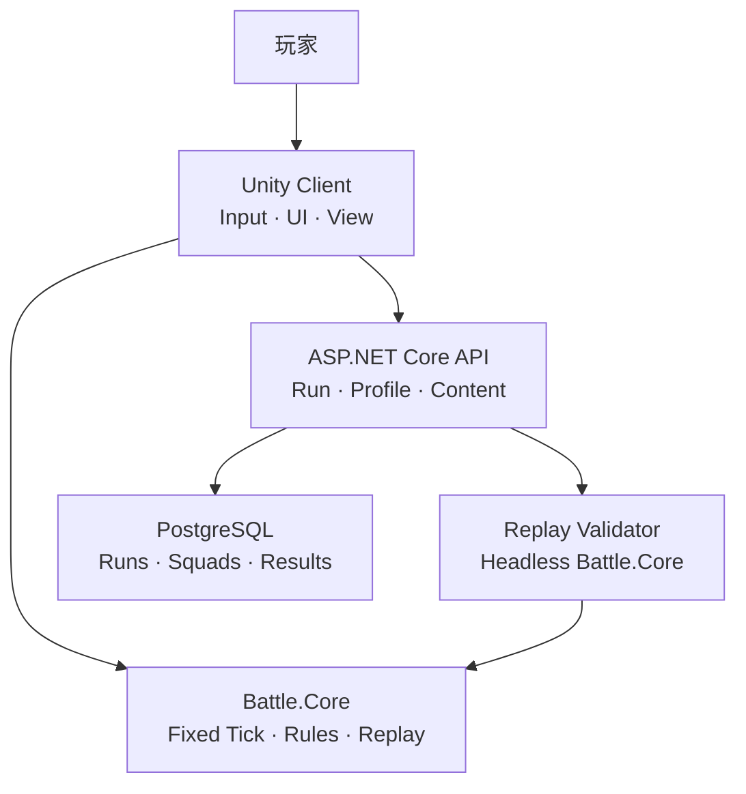

# Gridfront Tactics（格线前线）

A deterministic grid-based tactical defense vertical slice built with Unity and ASP.NET Core, featuring A\* pathfinding, stable targeting, capacity-based blocking, replay verification, and automated tests.

一个基于 Unity 与 ASP.NET Core 的网格战术塔防 Vertical Slice，重点实现 A\* 寻路、稳定索敌、容量阻挡、指令回放验证和自动化测试。

## Status

当前状态：**v0.1.0 仓库脚手架**（战斗内核与客户端尚未接入）。

## Features（规划）

- 固定 Tick 的纯 C# 战斗内核（`Battle.Core`，无 `UnityEngine` 依赖）
- 网格 A\* 寻路与路径缓存
- 稳定优先级索敌
- 容量阻挡双向关系
- 客户端指令日志 + 服务端复盘校验
- GitHub Actions 自动化测试

## Architecture



## Repository layout

```text
gridfront-tactics/
├─ client/          # Unity 客户端（后续接入）
├─ shared/          # Battle.Core + Contracts
├─ server/          # ASP.NET Core API
├─ content/         # 导出配置与 Schema
├─ docs/            # 架构、规则、ADR
└─ .github/         # Issue/PR 模板与 CI
```

## Run / Test

脚手架阶段命令将随 `v0.1.0` 内核落地补充。目标：

```bash
dotnet test
docker compose up
```

## Design non-goals

- 不做抽卡、商城、实时 PVP、完整养成
- 不 1:1 复刻任何商业塔防作品的美术或命名
- 服务端不是登录摆设，而要参与 Run 复盘验证

## License

MIT — see [LICENSE](LICENSE).

## Copyright

本仓库仅使用原创命名与资产。Genre inspiration: grid-based tactical defense。不包含第三方商业游戏的角色、图标、音效、地图或 UI 资源。
