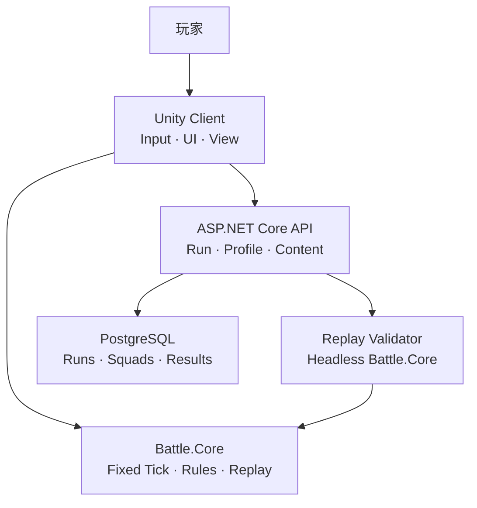

# Gridfront Tactics（格线前线）

A deterministic grid-based tactical defense vertical slice built with Unity and ASP.NET Core, featuring A\* pathfinding, stable targeting, capacity-based blocking, replay verification, and automated tests.

一个基于 Unity 与 ASP.NET Core 的网格战术塔防 Vertical Slice，重点实现 A\* 寻路、稳定索敌、容量阻挡、指令回放验证和自动化测试。

## Status

当前状态：**v0.1.0 已发布**；`v0.2.0` 内核 A\* 与 Unity 路径演示已在 `feat/pathfinding`。里程碑见 [docs/roadmap.md](docs/roadmap.md)。

## Features（规划）

- 固定 Tick 的纯 C# 战斗内核（`Battle.Core`，无 `UnityEngine` 依赖）
- 网格 A\* 寻路与路径缓存
- 稳定优先级索敌
- 容量阻挡双向关系
- 客户端指令日志 + 服务端复盘校验
- GitHub Actions 自动化测试

## Docs

| Doc | What you get in 30 seconds |
|---|---|
| [Product brief](docs/product-brief.md) | 范围、非目标、成功标准 |
| [Architecture](docs/architecture.md) | 分层、依赖、Tick、共享内核 |
| [Combat rules](docs/combat-rules.md) | 可测试战斗规则 |
| [Replay protocol](docs/replay-protocol.md) | Run / 复盘 / 拒绝原因 |
| [Roadmap](docs/roadmap.md) | `v0.1.0` → `v1.0.0` |
| [Testing](docs/testing.md) | 测试优先级与 P0 清单 |
| [Docs index](docs/README.md) | 文档真相顺序 |
| [Plan archive v1](docs/planning/project-plan-v1.md) | 完整策划快照（历史意图） |

## Architecture



## Repository layout

```text
gridfront-tactics/
├─ client/          # Unity 6 客户端（PathMarch 演示场景）
├─ shared/          # Battle.Core + Contracts
├─ server/          # ASP.NET Core API
├─ content/         # 导出配置与 Schema
├─ docs/            # 正式文档、ADR、策划归档
└─ .github/         # Issue/PR 模板与 CI
```

## Run / Test

```bash
dotnet test shared/Gridfront.BattleCore.Tests/Gridfront.BattleCore.Tests.csproj -c Release
```

Unity：用 **6000.5.0f1** 打开 `client/`，播放 `Assets/Gridfront/Scenes/PathMarch.unity`。`F2` 开关路径 Debug。

## Design non-goals

详见 [product brief](docs/product-brief.md)。摘要：

- 不做抽卡、商城、实时 PVP、完整养成
- 不 1:1 复刻任何商业塔防作品的美术或命名
- 服务端不是登录摆设，而要参与 Run 复盘验证

## License

MIT — see [LICENSE](LICENSE).

## Copyright

本仓库仅使用原创命名与资产。Genre inspiration: grid-based tactical defense。不包含第三方商业游戏的角色、图标、音效、地图或 UI 资源。
