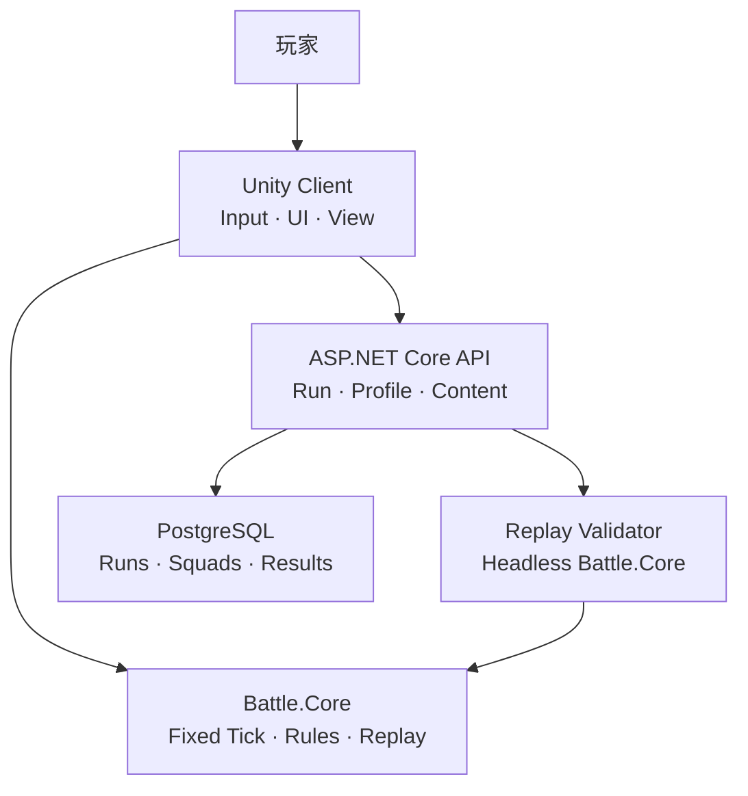
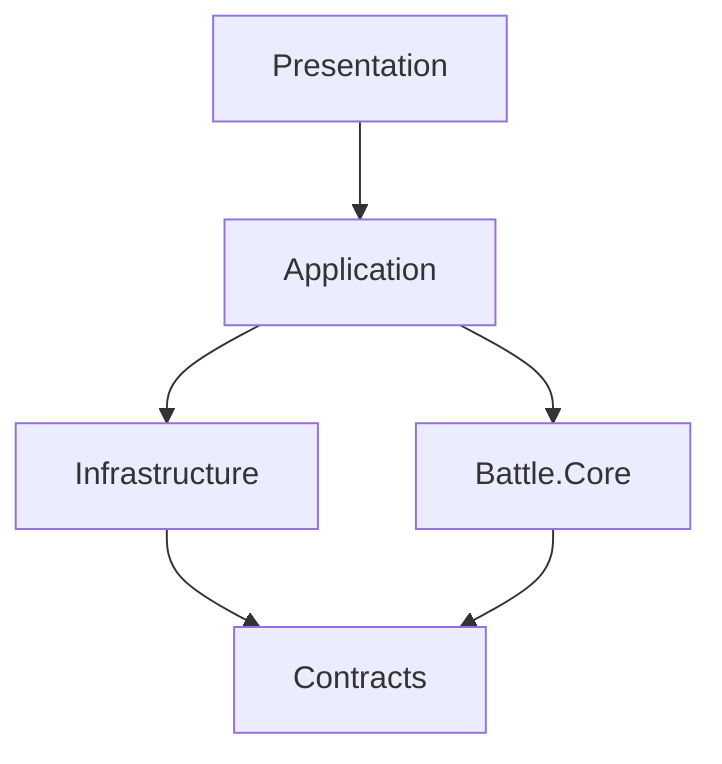
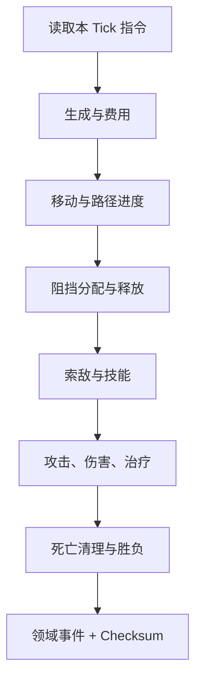

# Architecture

把战斗内核当成一台可复现的状态机：玩家输入先变成 Command；固定 Tick 的 Systems 依次修改 `BattleState` 并产生 Event；Unity 只负责把 Event 演出来；服务端用相同 Command、Seed 与配置复盘同一套内核。

归档来源：[planning/project-plan-v1.md](planning/project-plan-v1.md) §4–5。已接受决策见 [ADR-001](adr/ADR-001-pure-csharp-battle-core.md)、[ADR-002](adr/ADR-002-fixed-tick-and-integer-math.md)。

## System context



## Layers

| Module | Responsibility | Main outputs |
|---|---|---|
| `Battle.Core` | Tick、实体、寻路、索敌、阻挡、攻击、技能、胜负 | `BattleEvent`、Snapshot、Checksum |
| `Battle.Contracts` | Command、DTO、配置 Schema、版本号 | 可序列化消息 |
| `Client.Application` | 输入转 Command；驱动核心；同步 View | ViewModel、网络请求 |
| `Client.Presentation` | 地图、角色、动画、VFX、UI、Debug Overlay | 玩家可见表现 |
| `Client.Infrastructure` | HTTP、JSON、本地缓存、对象池、日志 | 接口适配器 |
| `Server.Api` | 身份、内容版本、Run 生命周期 | REST / OpenAPI |
| `Server.Validation` | 指令日志无头复盘，比较 Checksum | Verified / Rejected |
| `Server.Persistence` | EF Core、PostgreSQL、迁移 | 持久化记录 |

## Client dependency direction



Rules:

- `Battle.Core` 不引用 `UnityEngine`、HTTP、数据库、文件系统、真实时间  
- Presentation 不直接修改核心实体，只提交 Command  
- Infrastructure 负责序列化与网络，不含战斗判定  
- Server 可引用 Core 与 Contracts，不可引用 Unity 客户端程序集  

## Shared core packaging

同一份源码，双入口：

```text
shared/com.wexoy1n.gridfront.battle-core/
├─ package.json
├─ Runtime/                 # Unity asmdef, noEngineReferences
└─ dotnet~/
   └─ Gridfront.BattleCore.csproj   # Compile Include="../Runtime/**/*.cs"
```

- Unity：`Packages/manifest.json` 本地 `file:` 引用  
- Server：`ProjectReference` 指向 `dotnet~/*.csproj`  
- 禁止复制两份战斗逻辑；避免 Windows symlink 作为共享方案  

## Fixed tick pipeline

目标 `20 ticks/second`（50ms/tick）；画面 60 FPS 插值。



系统顺序固定；系统内遍历按稳定键（如 `EntityId`）排序。  
禁止在核心读取 `Time.deltaTime`、`DateTime.Now`、`Random.Shared`。

## Determinism requirements

- 核心时间只用整数 Tick  
- 位置 / 伤害 / 百分比用整数或定点数（例如 `1 tile = 1000 units`）  
- Dictionary 不作为决策遍历顺序  
- Command 含 `executeAtTick` 与单调 `sequence`  
- 配置带 `schemaVersion`、`contentVersion`、SHA-256 `configHash`  
- 每 N Tick 可产出分段 Checksum，便于定位首次分歧  

## Content pipeline

```text
ScriptableObject Authoring
        ↓ validate
Canonical JSON + schemaVersion
        ↓ SHA-256
Content Manifest
        ↙        ↘
Unity Client    Server Validator
```

ScriptableObject 是编辑工具，不是服务端真相。

## Suggested ADRs

| ADR | Topic | Status |
|---|---|---|
| [ADR-001](adr/ADR-001-pure-csharp-battle-core.md) | 纯 C# 战斗内核 | Accepted |
| [ADR-002](adr/ADR-002-fixed-tick-and-integer-math.md) | 固定 Tick 与整数数学 | Accepted |
| [ADR-003](adr/ADR-003-grid-a-star-instead-of-navmesh.md) | 网格 A\* 而非 NavMesh | Accepted |
| [ADR-004](adr/ADR-004-command-log-server-replay.md) | 指令日志服务端复盘 | Proposed |
| [ADR-005](adr/ADR-005-no-ecs-for-vertical-slice.md) | Vertical Slice 不做 ECS | Proposed |
