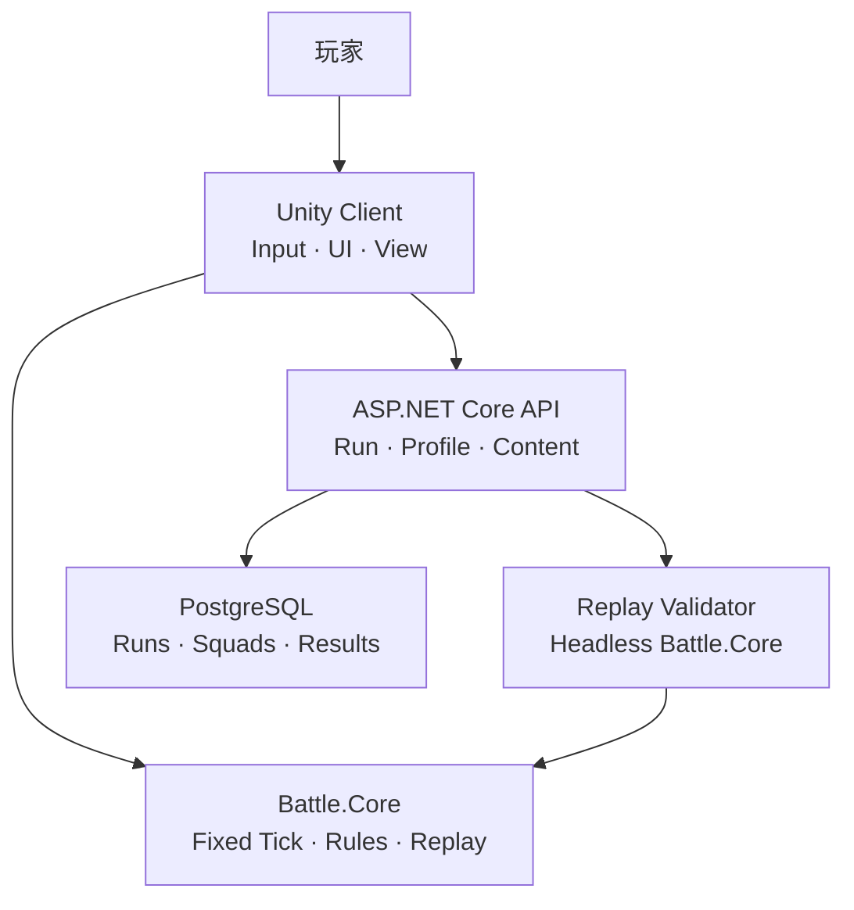
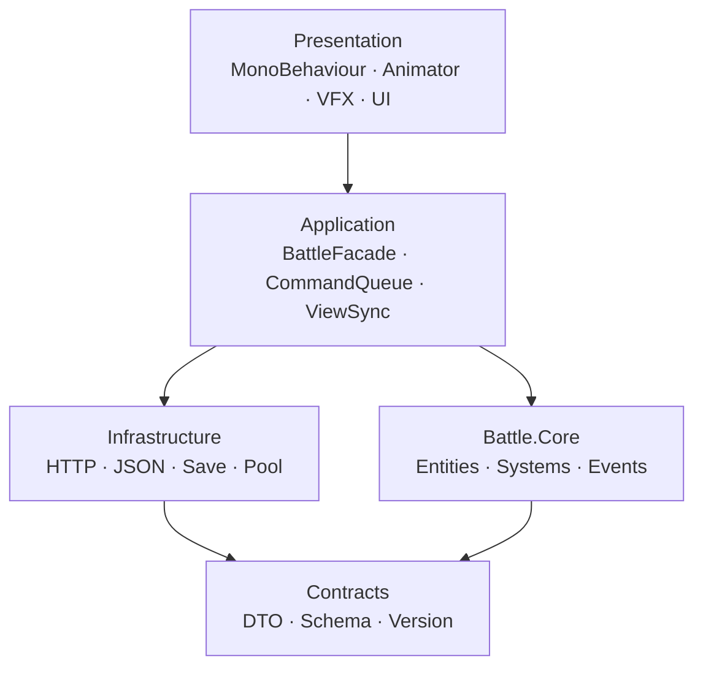
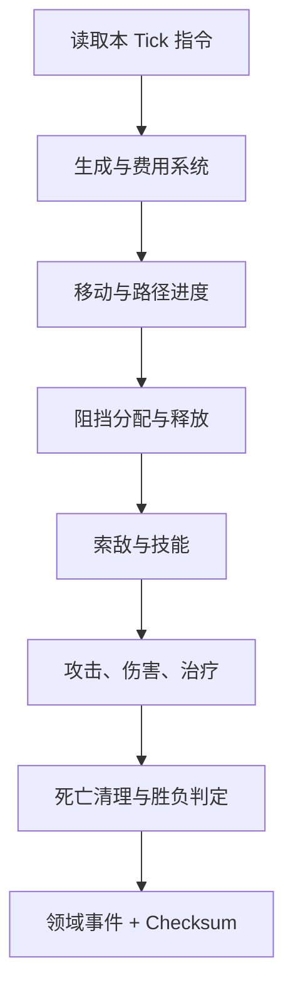
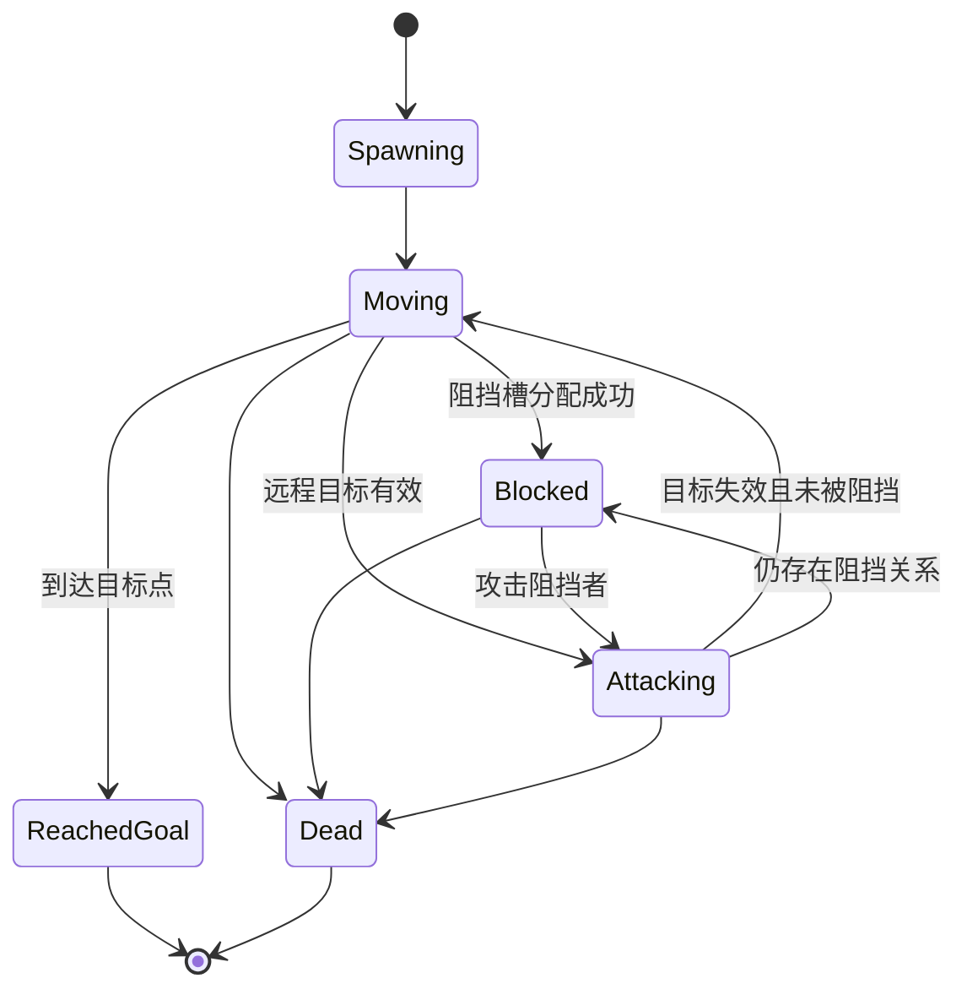
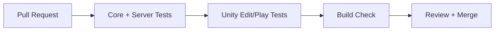

# Gridfront Tactics：战术塔防求职 Demo 策划案与顶层架构

> **归档快照（Archive）**  
> - 状态：Historical — 2026-08-02 规划原文入库，供追溯设计意图  
> - **当前真相**：以 [`docs/`](../README.md) 正式文档、[`adr/`](../adr/)、自动化测试与 GitHub Release 为准  
> - 拆解去向：[product-brief](../product-brief.md) · [architecture](../architecture.md) · [combat-rules](../combat-rules.md) · [replay-protocol](../replay-protocol.md) · [roadmap](../roadmap.md) · [testing](../testing.md)  
> - 本文可能包含已收敛的措辞或尚未实现的范围；发现冲突时以正式文档与测试为准，不必回头改归档正文

---

> 文档版本：v1.0（2026-08-02）  
> 项目类型：Unity 单机战术塔防 + ASP.NET Core 服务端验证  
> 建议仓库名：`gridfront-tactics`  
> 目标周期：8 周兼职开发，最终形成 8–12 分钟可完整演示的 Vertical Slice

## 0. 一句话结论

不要把它做成“换皮明日方舟”，而要做成一个**原创美术与命名、重点复现网格战术塔防规则、具备可测试战斗内核和服务端复盘校验能力**的工程型 Demo。

最值得展示的技术主线是：

1. 敌人基于网格图和 A* 寻路，并支持缓存、阻挡接触和可选重规划。
2. 角色与敌人的索敌采用“候选过滤 + 稳定优先级排序”，规则可配置且结果可复现。
3. 阻挡不是碰撞器临时判断，而是独立的双向关系和容量系统。
4. 战斗逻辑放在不依赖 `UnityEngine` 的纯 C# `Battle.Core` 中，以固定 Tick 推进。
5. 客户端上传玩家指令日志，服务端使用相同内核复盘并验证结果，而不是相信客户端上报的胜负。

这套设计既能完成好玩的 Demo，也能向面试官证明你具备玩法系统、算法、架构、测试、后端和 CI/CD 的完整能力。

---

## 1. 项目定位

### 1.1 对外名称与介绍

项目暂定名：**Gridfront Tactics（格线前线）**。

GitHub 简介建议：

> A deterministic grid-based tactical defense vertical slice built with Unity and ASP.NET Core, featuring A* pathfinding, stable targeting, capacity-based blocking, replay verification, and automated tests.

中文介绍：

> 一个基于 Unity 与 ASP.NET Core 的网格战术塔防 Vertical Slice，重点实现 A* 寻路、稳定索敌、容量阻挡、指令回放验证和自动化测试。

### 1.2 求职展示目标

| 展示方向 | 仓库中的直接证据 |
|---|---|
| 玩法工程 | 寻路、索敌、阻挡、攻击、技能、波次代码与规则文档 |
| 算法能力 | A*、稳定优先队列、空间查询、路径进度计算、确定性随机 |
| 架构能力 | 纯 C# 战斗内核、依赖方向图、Assembly Definition、DTO 边界 |
| 测试能力 | Edit Mode 单元测试、服务端集成测试、回放一致性测试、性能基准 |
| 后端能力 | REST API、PostgreSQL、EF Core、JWT/开发登录、OpenAPI、Docker Compose |
| 工程能力 | GitHub Issues/PR、语义化版本、GitHub Actions、可下载 Release、变更日志 |
| 产品意识 | 清晰范围、验收标准、风险控制、原创资产与版权说明 |

### 1.3 核心原则

- **先规则正确，再做表现。** 每条战斗规则都应能在无场景、无动画时通过测试。
- **固定范围，拒绝堆内容。** 求职 Demo 的重点是系统完成度，不是角色数量。
- **服务端为可信结果服务。** 不做无意义的“登录接口摆设”，要让服务端参与战斗验证闭环。
- **可观察。** Debug Overlay 能显示路径、射程、当前目标、阻挡关系、Tick、状态机和校验和。
- **原创表达。** 不使用《明日方舟》的名称、角色、图标、音效、地图、UI 截图或拆包资源。

---

## 2. Demo 范围

### 2.1 最终可玩内容

- 2 张原创地图：教学关、综合机制关。
- 6 个原创角色原型：先锋、近卫、重装、狙击、术师、医疗。
- 6 类敌人：普通兵、快速单位、重甲单位、远程单位、飞行单位、不可阻挡单位。
- 2 类技能：自动回复/手动释放；受击回复/自动释放可作为加分项。
- 20–40 个敌人的一局完整波次。
- 部署费用、部署位置、朝向、撤退、再部署冷却、生命值和失败目标。
- 战斗结算、战斗回放、服务端验证结果。
- Windows 可执行版本；WebGL 仅在时间充足时增加。

### 2.2 明确不做

- 抽卡、商城、付费、复杂养成、剧情系统。
- 实时 PVP、联机协作、帧同步联网战斗。
- 大量角色和关卡、复杂 LiveOps、生产级账号体系。
- 完整 ECS/DOTS 重构、微服务、Kubernetes。
- 对原作 UI 或美术进行 1:1 复刻。

### 2.3 成功标准

1. 新玩家在不读代码的情况下，3 分钟内理解部署、阻挡和技能。
2. Debug 模式能直观看到 A* 路径、索敌顺序和阻挡槽位。
3. 同一配置、Seed 和指令日志在客户端与服务端得到相同最终 Checksum。
4. Pull Request 必须通过 Battle.Core 单测和 Server 测试。
5. 仓库首页在 30 秒内让招聘者看见玩法 GIF、架构图、测试状态和下载入口。

---

## 3. 核心战斗策划

### 3.1 一局战斗循环

1. 服务端创建 Run，返回 `runId`、`seed`、`contentVersion` 和 `configHash`。
2. 客户端加载关卡与编队，进入准备阶段。
3. 敌人按波次生成并沿路线移动。
4. 玩家消耗部署费用，将角色放到合法格子并选择朝向。
5. 角色按索敌规则攻击；近战角色可建立阻挡关系。
6. 玩家释放技能、撤退并重新部署角色。
7. 敌人全部消灭则胜利；生命点归零则失败。
8. 客户端上传指令日志与最终 Checksum；服务端复盘后返回 `verified`。

### 3.2 地图与坐标

- 地图采用整数网格坐标 `GridPos(x, y)`。
- 格子类型：不可部署、近战位、高台位、出生点、目标点、可行走地面、特殊机关。
- 战斗内核中的连续位置使用“千分之一格”的整数，例如 `1 tile = 1000 units`。
- 表现层可使用 `Vector3` 插值，但不得把 Unity 浮点坐标写回核心状态。
- 射程使用相对格坐标集合，而不是圆形 Collider，以保证策划可控和可测试。

### 3.3 敌人寻路

#### P0：预定义路线 + A* 生成

关卡配置只保存起点、终点、必经点与可行走网格。加载关卡时，以每段必经点为边界执行 A*，拼接为最终路线并缓存。移动时不每帧寻路，只沿缓存的路径段推进。

A* 代价建议：

- `g`：已移动成本；直邻格默认 10。
- `h`：曼哈顿距离 × 10。
- `f = g + h`。
- 优先级相同时按 `h`、网格索引排序，保证结果稳定。
- 禁止斜向移动，避免穿角和表现歧义。

#### P1：动态重规划

如果后续增加可改变道路的障碍物，仅在“地图导航版本号改变”时重规划：

- 地图维护 `navVersion`。
- 路径缓存键为 `(start, goal, movementType, navVersion)`。
- 普通角色部署不改变路径，只影响阻挡；特殊路障才递增 `navVersion`。
- 无路可走时进入 `WaitingForPath`，在有限次数重试后触发关卡规则，而不是无限搜索。

#### 路径进度

为索敌提供 `routeProgress`：

```text
routeProgress = 已走完路径段长度 + 当前路径段内的归一化距离
```

“离目标最近”按 `routeProgress` 降序，而不是按世界坐标直线距离判断。

### 3.4 角色索敌

索敌流程必须拆成四步：

1. **空间收集**：从覆盖格或空间索引得到候选实体。
2. **合法性过滤**：存活、阵营、地面/飞行、隐匿、可被选中、射程内。
3. **优先级评分**：默认优先 `routeProgress` 更大者，可叠加嘲讽等级和模板规则。
4. **稳定决胜**：完全相同则按距离、`spawnSequence`、`EntityId` 排序。

默认排序键：

```text
(-tauntLevel, -routeProgress, distanceSquared, spawnSequence, entityId)
```

角色不必每个 Tick 全量索敌：目标仍合法时保持锁定；目标死亡、离开射程或不可选中后再搜索。必要时每 2–4 Tick 刷新一次候选，降低开销。

### 3.5 敌人索敌

- 被阻挡的近战敌人只攻击自己的 `blockedByOperatorId`。
- 未被阻挡的远程敌人，从攻击范围内角色中按“嘲讽等级 → 距离 → 部署顺序 → EntityId”选择。
- 治疗型或支援型敌人走独立 `TargetPolicy`，不要在敌人类里写大量 `if/else`。
- 目标死亡、撤退、不可选中或离开范围时释放目标。

### 3.6 阻挡机制

阻挡应作为领域系统，不依赖 `OnTriggerEnter2D` 决定真相。

核心字段：

```csharp
OperatorState.BlockCapacity
OperatorState.BlockedEnemyIds
EnemyState.BlockedByOperatorId
EnemyState.IsBlockable
```

建立阻挡的条件：

- 敌人可阻挡且未被其他角色阻挡。
- 敌人进入角色所在格的“阻挡接触区”。
- 角色存活、已部署、未眩晕到失去阻挡能力。
- `BlockedEnemyIds.Count < BlockCapacity`。

建立关系必须原子化：同时写入角色的集合和敌人的反向引用，并发出 `EnemyBlockedEvent`。没有空位时敌人继续移动。

解除条件：任一方死亡、角色撤退、角色失去阻挡能力、敌人变为不可阻挡、关卡结束。解除时必须清除双向关系并发出 `EnemyReleasedEvent`，防止“幽灵阻挡”。

阻挡选择默认按接触 Tick 和 `spawnSequence` 排序；同一 Tick 到达的敌人必须有稳定结果。

### 3.7 攻击与伤害

每次攻击采用时间线，而不是动画事件驱动核心规则：

```text
Idle → AcquireTarget → Windup → HitFrame → Recovery → Idle
```

- `WindupTicks` 到达时生成伤害事件。
- 表现动画只消费事件；即使没有 Animator，战斗结果也应一致。
- 物理伤害 P0 公式：`max(minDamage, attack - defense)`。
- 法术伤害 P0 公式：`attack × (1 - resistance)`，统一整数舍入策略。
- 死亡在本 Tick 的 Damage 阶段统一收集，在 Cleanup 阶段统一处理，避免遍历中删除实体。
- 先用单目标；范围伤害、弹道和持续伤害放入后续迭代。

### 3.8 技能、Buff 与状态

P0 技能由数据驱动：

- 触发：手动或自动。
- 充能：随时间、攻击或受击。
- 持续：瞬时或持续若干 Tick。
- 效果：属性修改、改变攻击目标数、治疗、造成一次伤害。

Buff 使用独立 Modifier：

```text
最终值 = ((基础值 + FlatAdd 总和) × PercentAdd 总和) × FinalMultiplier
```

每个效果有 `sourceId`、`stackRule`、`durationTicks` 和 `priority`。P0 只实现 4–5 种通用 Effect，避免脚本类爆炸。

---

## 4. 顶层技术架构

### 4.1 推荐技术栈

| 层 | 选择 | 理由 |
|---|---|---|
| 客户端 | Unity 6.3 LTS，URP，2D/2.5D | LTS 更适合作品集；Unity 6 当前文档仍以 .NET Standard 2.1 为默认兼容层 |
| 战斗核心 | C#、`netstandard2.1`、无 `UnityEngine` | Unity 与 .NET 10 服务端可引用同一套规则代码 |
| 服务端 | ASP.NET Core 10 Minimal API | .NET 10 为当前 LTS；适合轻量 REST、DI、OpenAPI 和测试 |
| 数据访问 | EF Core 10 + PostgreSQL | 关系清晰、迁移方便，适合作品集部署 |
| 本地环境 | Docker Compose | 一条命令启动 API 与数据库 |
| 自动化 | GitHub Actions | PR 自动测试，Tag 自动构建 Release |
| API 文档 | OpenAPI 3.1 | 让面试官无需读服务端代码即可理解接口 |

> 若你的电脑或插件尚未稳定支持上述版本，可以将服务端降为 .NET 8，但截至 2026-08，.NET 8 已处于维护阶段且将在 2026-11 结束支持，因此新项目更推荐 .NET 10。

### 4.2 系统全景



### 4.3 客户端依赖方向



依赖规则：

- `Battle.Core` 不引用 `UnityEngine`、HTTP、数据库、文件系统和真实时间。
- `Presentation` 不直接修改核心实体，只提交 Command。
- `Infrastructure` 负责序列化和网络，不包含战斗判定。
- `Server` 可以引用 `Battle.Core` 与 `Contracts`，不能引用 Unity 客户端程序集。

### 4.4 Fixed Tick 战斗流水线

建议 `20 ticks/second`，即一个 Tick 50ms；画面以 60 FPS 插值。



系统顺序固定，系统内部遍历按 `EntityId` 排序。禁止在核心里读取 `Time.deltaTime`、`DateTime.Now` 或 `System.Random.Shared`。

### 4.5 核心模块

| 模块 | 责任 | 主要输出 |
|---|---|---|
| `Battle.Core` | Tick、实体状态、寻路、索敌、阻挡、攻击、技能、胜负 | `BattleEvent`、Snapshot、Checksum |
| `Battle.Contracts` | Command、DTO、配置 Schema、版本号 | 可序列化消息 |
| `Client.Application` | 将输入转为 Command；驱动核心；同步 View | ViewModel、网络请求 |
| `Client.Presentation` | 地图、角色、动画、VFX、UI、音效、调试可视化 | 玩家可见表现 |
| `Client.Infrastructure` | HTTP、JSON、本地缓存、对象池、日志 | 接口适配器 |
| `Server.Api` | 身份、内容版本、Run 生命周期、编队与结果接口 | REST/OpenAPI |
| `Server.Validation` | 读取指令日志，使用核心复盘，比较 Checksum | Verified/Rejected |
| `Server.Persistence` | EF Core、PostgreSQL、迁移、Repository | 持久化记录 |

### 4.6 共享代码的落地方式

将战斗核心做成本地 Unity Package，同时提供 .NET 项目文件编译相同源码：

```text
shared/com.yourname.gridfront.battle-core/
├─ package.json
├─ Runtime/
│  ├─ Gridfront.BattleCore.asmdef
│  ├─ Domain/
│  ├─ Systems/
│  ├─ Pathfinding/
│  └─ Replay/
├─ Tests/
└─ dotnet/
   └─ Gridfront.BattleCore.csproj   # Compile Include="../Runtime/**/*.cs"
```

不要用 Windows Symbolic Link 共享源码，也不要复制两份战斗逻辑。Unity Package 通过 `Packages/manifest.json` 的本地相对路径引用；服务端通过 `ProjectReference` 引用 `dotnet` 项目。

---

## 5. 领域模型与关键接口

### 5.1 核心实体

```csharp
public sealed record BattleState(
    int Tick,
    BattlePhase Phase,
    int DeployCost,
    int BaseLife,
    ulong Seed,
    IReadOnlyDictionary<int, OperatorState> Operators,
    IReadOnlyDictionary<int, EnemyState> Enemies);

public interface IBattleCommand
{
    int ExecuteAtTick { get; }
    long Sequence { get; }
}

public interface IBattleSystem
{
    void Step(BattleContext context);
}

public interface ITargetPolicy
{
    EntityId? SelectTarget(in TargetQuery query);
}
```

Command 类型：

- `DeployOperatorCommand`
- `RetreatOperatorCommand`
- `ActivateSkillCommand`
- `SetBattleSpeedCommand`（只影响客户端表现，不进入验证）

领域事件：

- `EntitySpawnedEvent`
- `PathAssignedEvent`
- `TargetAcquiredEvent`
- `EnemyBlockedEvent` / `EnemyReleasedEvent`
- `AttackStartedEvent` / `DamageAppliedEvent`
- `SkillActivatedEvent`
- `EntityDiedEvent`
- `BattleEndedEvent`

### 5.2 敌人状态机



### 5.3 确定性要求

- 核心时间只使用整数 Tick。
- 位置、伤害、攻速和百分比采用整数或定点数。
- 随机事件使用自有、带 Seed 的 PRNG；MVP 可以完全不使用随机。
- Dictionary 不作为决策遍历顺序；决策前按稳定键排序。
- 所有 Command 包含 `executeAtTick` 和单调递增 `sequence`。
- 配置带 `schemaVersion`、`contentVersion` 和 SHA-256 `configHash`。
- 每 N 个 Tick 产生 Canonical Snapshot Checksum，便于快速定位客户端与服务端首次分歧。

### 5.4 配置生产链

策划在 Unity Editor 中编辑 ScriptableObject，构建前导出规范化 JSON：

```text
ScriptableObject Authoring
        ↓ validate
Canonical JSON + schemaVersion
        ↓ SHA-256
Content Manifest
        ↙        ↘
Unity Client    Server Validator
```

ScriptableObject 是编辑工具，不是服务端真相。导出器必须验证重复 ID、非法射程、断路、负数属性和无效引用。

---

## 6. 服务端方案

### 6.1 为什么这个 Demo 需要服务端

服务端的价值不是强行把单机玩法联网，而是构成“可信 Run”闭环：

- 分发内容版本和 Seed。
- 保存编队与历史战绩。
- 接收指令日志。
- 用共享 `Battle.Core` 无头复盘。
- 拒绝篡改后的胜利、分数或耗时。
- 可选提供已验证排行榜和公开回放。

### 6.2 API

| 优先级 | 方法与路径 | 作用 |
|---|---|---|
| P0 | `POST /api/v1/auth/guest` | 创建开发/游客身份并返回 Token |
| P0 | `GET /api/v1/content/manifest` | 获取内容版本、Hash 与关卡列表 |
| P0 | `POST /api/v1/runs` | 创建 Run，返回 Seed、版本和过期时间 |
| P0 | `POST /api/v1/runs/{id}/finish` | 上传指令日志与 Checksum，触发复盘 |
| P0 | `GET /api/v1/runs/{id}` | 查询验证状态与战斗摘要 |
| P1 | `GET /api/v1/profile` | 获取玩家资料 |
| P1 | `PUT /api/v1/squads/{id}` | 保存编队 |
| P1 | `GET /api/v1/leaderboard` | 只返回已验证记录 |
| P2 | `GET /api/v1/replays/{id}` | 获取公开回放 |

创建 Run 响应示例：

```json
{
  "runId": "01J...",
  "stageId": "stage_02",
  "seed": 92133741,
  "contentVersion": "0.7.0",
  "configHash": "sha256:...",
  "expiresAt": "2026-08-02T12:00:00Z"
}
```

Finish 请求不上传“我赢了，所以给我奖励”，而是上传：

- `runId`
- `orderedCommands`
- `finalTick`
- `clientChecksum`
- 可选的分段 Checksum

服务端根据数据库中的 Seed、关卡版本和编队复盘，自己计算胜负与分数。

### 6.3 数据表

| 表 | 关键字段 |
|---|---|
| `users` | `id`, `display_name`, `created_at` |
| `content_versions` | `version`, `config_hash`, `published_at` |
| `squads` | `id`, `user_id`, `payload_json`, `updated_at` |
| `run_sessions` | `id`, `user_id`, `stage_id`, `seed`, `content_version`, `status`, `expires_at` |
| `run_submissions` | `run_id`, `commands_json`, `client_checksum`, `submitted_at` |
| `run_results` | `run_id`, `verified`, `server_checksum`, `score`, `final_tick`, `reject_reason` |

MVP 可把指令日志保存在 PostgreSQL `jsonb` 中。等确有性能问题，再考虑压缩二进制或独立对象存储。

### 6.4 最低安全边界

- Token 只用于 Demo 身份，不在仓库提交密钥。
- `appsettings.Development.json` 只放非敏感默认值；密钥由环境变量注入。
- Finish 接口限制体积、Command 数量、Tick 范围和 Run 过期时间。
- Finish 使用 Idempotency Key，重复提交返回同一结果。
- 服务端不接受客户端指定 Seed、配置 Hash、最终分数和验证状态。
- 日志中不记录完整 Token。

---

## 7. GitHub 仓库结构

```text
gridfront-tactics/
├─ README.md
├─ LICENSE
├─ CHANGELOG.md
├─ CONTRIBUTING.md
├─ docker-compose.yml
├─ client/
│  ├─ Assets/Gridfront/
│  │  ├─ Application/
│  │  ├─ Presentation/
│  │  ├─ Infrastructure/
│  │  ├─ Editor/
│  │  └─ Tests/
│  ├─ Packages/
│  └─ ProjectSettings/
├─ shared/
│  ├─ com.yourname.gridfront.battle-core/
│  └─ Gridfront.Contracts/
├─ server/
│  ├─ Gridfront.Server.sln
│  ├─ src/
│  │  ├─ Gridfront.Api/
│  │  ├─ Gridfront.Application/
│  │  ├─ Gridfront.Validation/
│  │  └─ Gridfront.Persistence/
│  └─ tests/
├─ content/
│  ├─ schema/
│  └─ exported/
├─ docs/
│  ├─ architecture.md
│  ├─ combat-rules.md
│  ├─ replay-protocol.md
│  ├─ adr/
│  └─ media/
└─ .github/
   ├─ workflows/
   ├─ ISSUE_TEMPLATE/
   └─ pull_request_template.md
```

### 7.1 README 首页顺序

1. 10–15 秒战斗 GIF。
2. 一句话项目价值。
3. 可直接下载的 Release。
4. Features：A*、索敌、阻挡、回放验证、测试。
5. 架构图。
6. 运行方法：客户端、服务端、Docker Compose。
7. 测试命令与 CI Badge。
8. 设计取舍与非目标。
9. 性能数据与测试环境。
10. 版权与第三方资产声明。

### 7.2 Git 策略

- `main` 始终可运行；短分支 `feat/pathfinding-cache`、`fix/block-release-on-retreat`。
- 一个 Issue 对应一个可验证行为；一个 PR 尽量只解决一个主题。
- PR 必须含：动机、改动、测试、截图/GIF、风险。
- 版本 Tag：`v0.1.0` 到 `v1.0.0`；每个里程碑保留 GitHub Release Notes。
- Commit 示例：`feat(core): add stable target priority policy`。
- 使用 Conventional Commits，但不要为了“提交漂亮”把真实开发历史压成一个巨型提交。

### 7.3 建议 ADR

- `ADR-001-pure-csharp-battle-core.md`
- `ADR-002-fixed-tick-and-integer-math.md`
- `ADR-003-grid-a-star-instead-of-navmesh.md`
- `ADR-004-command-log-server-replay.md`
- `ADR-005-no-ecs-for-vertical-slice.md`

每篇只写：背景、决定、备选项、后果。面试时 ADR 比“我用了某某设计模式”更有说服力。

---

## 8. 分批迭代路线

周期按每周约 15–20 小时估算。若全职开发，可压缩为 4–5 周，但不要减少验收和测试。

| 版本 | 时间 | 交付内容 | 必须通过的验收 |
|---|---:|---|---|
| `v0.1.0` 基础骨架 | 第 1 周前半 | Monorepo、Unity 场景、Battle.Core、固定 Tick、CI 雏形 | 无场景运行 1,000 Tick；同 Seed 结果一致 |
| `v0.2.0` 寻路演示 | 第 1 周后半 | 网格、A*、路径缓存、敌人生成与移动、路径 Debug | 多路线正确；无路状态可控；稳定路径测试通过 |
| `v0.3.0` 部署与索敌 | 第 2 周 | 部署合法性、朝向射程、角色索敌、攻击时间线 | 目标排序稳定；目标失效后正确重选 |
| `v0.4.0` 阻挡与敌人战斗 | 第 3 周 | 阻挡容量、双向关系、敌人索敌、死亡/撤退释放 | 1/2/3 阻挡均正确；无幽灵引用 |
| `v0.5.0` 完整关卡 | 第 4 周 | 波次、费用、技能、治疗、胜负、2 张地图 | 可从开始完整玩到结算；教学关可理解 |
| `v0.6.0` 服务端闭环 | 第 5 周 | Auth、Manifest、Run、Finish、PostgreSQL、OpenAPI | Docker Compose 一键启动；接口集成测试通过 |
| `v0.7.0` 回放验证 | 第 6 周 | Command Log、分段 Checksum、服务端复盘与拒绝原因 | 合法日志通过；篡改指令/Hash 被拒绝 |
| `v0.8.0` 工具与性能 | 第 7 周 | 配置校验器、对象池、空间索引、Benchmark、Debug HUD | 200 敌人基准有数据；非法配置构建失败 |
| `v1.0.0` 求职发布 | 第 8 周 | 原创 UI/VFX/音效、教程、GIF、视频、Release、文档 | 新机器按 README 可运行；完整演示无阻塞 Bug |

### 每个版本的完成定义

- 有对应 Issue 和验收清单。
- 核心行为至少有一个自动化测试。
- README 或 `docs/` 更新。
- 有 10–30 秒 GIF 或截图证明功能。
- `main` 构建通过并打 Tag。
- 不留下阻塞下一阶段的临时硬编码。

---

## 9. 测试计划

### 9.1 Battle.Core 单元测试（最高优先级）

至少覆盖：

1. A* 找到最短路径。
2. 多条同成本路径得到稳定结果。
3. 断路时返回明确失败，不死循环。
4. 路径进度跨越拐点仍单调增加。
5. 默认索敌优先选择离目标最近的敌人。
6. 完全同优先级时按稳定键决胜。
7. 飞行/隐匿/不可选中目标被正确过滤。
8. 角色锁定目标在合法时不抖动切换。
9. Block 1 只能接收一个敌人。
10. Block N 按接触顺序分配。
11. 满阻挡时额外敌人继续前进。
12. 角色撤退后所有敌人同时释放。
13. 角色死亡和敌人死亡不会留下反向引用。
14. 攻击 HitFrame 只结算一次。
15. 同 Tick 多次伤害后统一死亡清理。
16. 同 Seed + Command Log 得到同 Checksum。
17. 修改一个 Command 后 Checksum 出现分歧。
18. 战斗结束后不再接受玩法 Command。

### 9.2 Unity 测试

- Edit Mode：配置导出、射程格生成、地图验证、ViewModel 映射。
- Play Mode：部署交互、动画事件消费、对象池回收、场景加载、HUD。
- 不把每条规则都用 Play Mode 测；核心规则留在快速的纯 C# 测试里。

### 9.3 服务端测试

- API 合约与鉴权。
- 创建 Run 的 Seed/版本来自服务端。
- Finish 幂等性。
- 过期 Run、错误 Hash、超限指令、乱序 Sequence 被拒绝。
- 真实 PostgreSQL 的最小集成测试可由 Testcontainers 或 CI Service Container 完成。
- 回放校验成功和失败都保存可解释的原因。

### 9.4 性能目标

目标而非提前宣称：

- 1080p 下客户端目标 60 FPS。
- 200 个敌人时 `Battle.Core.Step` 的 p95 目标低于 2ms（以开发机实测为准）。
- 10 分钟战斗的服务端复盘目标低于 1 秒。
- README 同时写 CPU、构建版本、实体数量、Tick Rate、均值与 p95。

---

## 10. CI/CD 与发布

### Pull Request 流程



建议工作流：

- `dotnet-ci.yml`：restore、format check、build、test、coverage。
- `unity-tests.yml`：Edit Mode 与 Play Mode 测试。
- `content-validation.yml`：校验 JSON Schema、重复 ID、地图可达性和 Hash。
- `release.yml`：Tag 后构建 Windows 客户端、API Docker Image、Release Notes。

Unity License 等 Secret 只配置在 GitHub Actions Secret 中，不进入仓库。初期如果 Unity 云构建配置影响进度，可以先让 `dotnet-ci` 和内容校验成为 Required Check，再补 Unity 自动构建。

---

## 11. 调试与作品集表现

### 11.1 必做 Debug Overlay

按键建议：

- `F1`：网格与可部署类型。
- `F2`：敌人路径、当前路径节点、`routeProgress`。
- `F3`：角色射程、候选目标、最终目标与优先级分数。
- `F4`：阻挡连线、槽位数量、双向关系。
- `F5`：Tick、Seed、Command 数、Checksum。
- `F6`：AI 状态机和攻击时间线。

这不是仅供开发的临时工具，而是最终视频的核心展示内容。

### 11.2 演示视频脚本（约 3 分钟）

1. **0:00–0:20**：完整战斗效果和项目一句话介绍。
2. **0:20–0:50**：开启路径 Debug，展示 A*、必经点与进度。
3. **0:50–1:20**：冻结 Tick，展示三个敌人的索敌排序与稳定决胜。
4. **1:20–1:50**：展示 Block 2、第三个敌人穿过、撤退后同时释放。
5. **1:50–2:20**：展示客户端指令日志和服务端成功复盘。
6. **2:20–2:40**：篡改一个 Command，服务端显示首次 Checksum 分歧 Tick。
7. **2:40–3:00**：架构图、测试数量、CI 和下载链接。

### 11.3 简历表述示例

中文：

> 独立开发 Unity 网格战术塔防 Vertical Slice，将寻路、稳定索敌、容量阻挡与技能系统抽离为无 Unity 依赖的固定 Tick C# 内核；使用 ASP.NET Core 与 PostgreSQL 构建 Run 服务，并以共享内核复盘客户端指令日志完成结果校验；为关键规则、接口和回放一致性建立自动化测试与 GitHub Actions 流程。

英文：

> Built a Unity grid-based tactical defense vertical slice with a fixed-tick, engine-agnostic C# combat core covering A* pathfinding, stable target selection, capacity-based blocking, and skills. Developed an ASP.NET Core/PostgreSQL run service that replays client command logs with the shared core for authoritative result verification, backed by automated tests and GitHub Actions.

最终简历中的数字必须来自真实测试，例如测试数量、覆盖的战斗实体数、复盘耗时，不能提前编造。

---

## 12. 主要风险与处理

| 风险 | 早期信号 | 处理方式 |
|---|---|---|
| 范围失控 | 第 3 周仍在加职业和技能 | 锁定 6 角色、6 敌人、2 地图，新增内容放 Backlog |
| 表现绑架规则 | 取消 Animator 后战斗不运行 | 核心只发事件，View 只消费事件 |
| 跨端不一致 | 同日志在服务端结果不同 | 整数 Tick/定点数、稳定排序、分段 Checksum |
| 寻路过度计算 | 每个敌人每帧跑 A* | 路径缓存；仅 `navVersion` 变化时重算 |
| 阻挡引用残留 | 撤退后敌人仍停留 | 双向关系、单一 BlockSystem、Cleanup 不变量测试 |
| 服务端沦为摆设 | 只有登录和存档接口 | 把 Run Seed、配置版本和复盘验证放入 P0 |
| Unity CI 卡住 | License 或构建不稳定 | 先保证纯 C# 与服务端 CI；Unity CI 分阶段接入 |
| 版权争议 | README/素材过度提及原作 | 原创命名和素材，只说明 genre inspiration，不做品牌化复刻 |

---

## 13. 开发顺序：最先写什么

### 前 48 小时

1. 建仓库、`.gitignore`、README 骨架、License、Issue 模板。
2. 创建 `Battle.Core`，实现 `BattleState`、`BattleRunner.Step()`、Command Queue。
3. 写“同一输入 1,000 Tick Checksum 相同”的第一个测试。
4. Unity 场景只放网格与一个圆形敌人 View，通过 Adapter 读取核心位置。
5. 创建 `ADR-001` 与 `ADR-002`，记录纯内核和固定 Tick 决定。

### 第一周结束前

1. 完成网格图、A*、路径缓存、路线 Debug。
2. 让 20 个无美术敌人完成出生到目标点。
3. 建立自动测试和 PR 工作流。
4. 发布 `v0.2.0` GIF；此时不要先做精美角色立绘。

---

## 14. 代码审查时要守住的不变量

- 一个敌人最多被一个角色阻挡。
- 角色的 `BlockedEnemyIds.Count` 永不超过 `BlockCapacity`。
- 阻挡双方引用必须一致。
- 死亡/撤退实体不能保留目标或阻挡关系。
- 每条玩法 Command 只在指定 Tick 执行一次。
- 战斗结束后状态不再被玩法系统修改。
- 目标排序在相同输入下结果稳定。
- 客户端和服务端只加载与 `configHash` 对应的配置。
- 表现层丢帧或动画缺失不能改变核心结果。

建议在 Debug 构建的每个 Tick 后运行轻量 `BattleInvariantChecker`，在 Release 构建中关闭。

---

## 15. 最终交付清单

- [ ] `v1.0.0` Windows 可执行文件。
- [ ] Docker Compose 可启动 API + PostgreSQL。
- [ ] 两张可完整通关的原创地图。
- [ ] 6 个角色原型和 6 类敌人。
- [ ] 寻路、索敌、阻挡、攻击、技能、撤退、胜负完整闭环。
- [ ] Command Log 与服务端复盘验证。
- [ ] Debug Overlay 与首次分歧 Tick。
- [ ] 核心、Unity、服务端测试和 CI Badge。
- [ ] 架构、战斗规则、回放协议和 ADR 文档。
- [ ] 10–15 秒首页 GIF、3 分钟技术视频、6–10 张清晰截图。
- [ ] Release 下载、运行说明、第三方资产和版权声明。
- [ ] 简历中只写实测数据。

---

## 16. 技术选择依据

- Unity 官方将 Unity 6.3 标记为 LTS，并提供对应版本说明：[New in Unity 6.3 LTS](https://docs.unity3d.com/6000.5/Documentation/Manual/WhatsNewUnity63.html)。
- Unity 6 文档说明默认 API Compatibility Level 为 .NET Standard 2.1，适合把共享内核目标定为 `netstandard2.1`：[API compatibility levels for .NET](https://docs.unity3d.com/6000.5/Documentation/Manual/dotnet-profile-support.html)。
- Unity 的 Assembly Definition 用于拆分和组织脚本程序集，可落实 Core/Application/Presentation 的依赖边界：[Introduction to assemblies in Unity](https://docs.unity3d.com/6000.1/Documentation/Manual/assembly-definitions-intro.html)。
- Unity Test Framework 支持 Edit Mode 与 Play Mode 测试：[Edit mode and Play mode tests](https://docs.unity3d.com/6000.4/Documentation/Manual/test-framework/edit-mode-vs-play-mode-tests.html)。
- 截至 2026-08，.NET 10 是 Active LTS，支持至 2028-11；.NET 8 将于 2026-11 结束支持：[Official .NET support policy](https://dotnet.microsoft.com/en-us/platform/support/policy)。
- ASP.NET Core 10 内置生成 OpenAPI 3.1 文档的支持：[Generate OpenAPI documents](https://learn.microsoft.com/en-us/aspnet/core/fundamentals/openapi/aspnetcore-openapi?view=aspnetcore-10.0)。
- GitHub 官方提供 .NET 构建与测试的 Actions 工作流指南：[Building and testing .NET](https://docs.github.com/actions/guides/building-and-testing-net)。

---

## 17. 最终架构决策摘要

如果只记住一件事：**把战斗内核当成一台可复现的状态机，而不是一堆 MonoBehaviour。**

玩家输入先变成 Command；固定 Tick 的 Systems 依次修改 BattleState 并产生 Event；Unity 只负责把 Event 演出来；服务端拿同样的 Command、Seed 和配置重放同一套内核。这样寻路、索敌和阻挡会自然变得可测试，服务端也不再是附加装饰。

